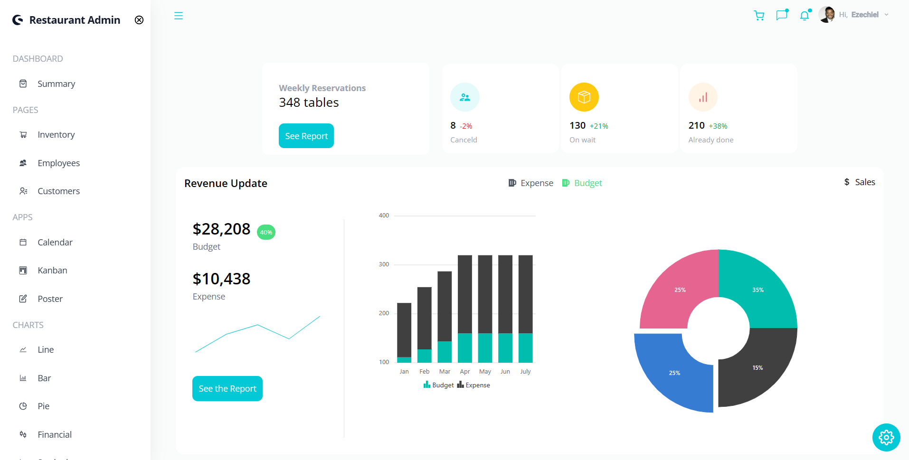
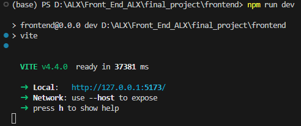

## RESTAURANT INVENTORY MANAGEMENT SYSTEM

A restaurant management system is a type of point-of-sale (POS) software specifically designed for restaurants, bars, food trucks and others in the foodservice industry.

You can manage almost every pertinent aspect of your restaurant, depending on which type of RMS you choose. With an end-to-end system, you will have complete access to these functions and features: 

- Employee schedules, including daily, vacation and sick time
- Financial statements
- Inventory
- Reporting and analytics
- CRM
- Menu

### Techology used
The project is done using React in the frontend part. And thanks to all the libraries that react has, we decided to work with `syncfusion` library. With this tool, we are able to design schedules, make calendars, kanban, charts and much more. with this library, we were able to do the 97% of frontend. The other libraries like `react-icons` and `three js` are the sumplementary of the whole frontend part.

And second of all, we have the `tailwindcss` library that we are using to make css more compilable and dynamic using classes. You can check its documentation at its official website [here]('tailwindcss.com)

We decided to use `Vite` in order to quickly run this project along side with `npm`. Vite is one of the latest solution used by react for node package management.
If you want to learn more about vite, you can vite, you can check thier documentation.

Here on top, is the presentation on how we run the local project using vite.

### How to run the project ?
In order to run this project you need to follow the following steps.
- Clone this project in your local repository;
- Open your terminal, (Git Bash is preferable);
- Enter in the __frontend__ directory by using `cd frontend` in your terminal
- Install npm by running `npm install` in your terminal
- Then run `npm run dev`

Then vite will open up a suggestion of the localhost and the port that opens the the app.
it is usally __http://127.0.0.1:5173__

